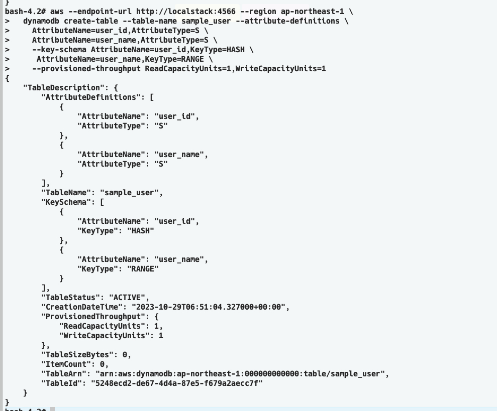
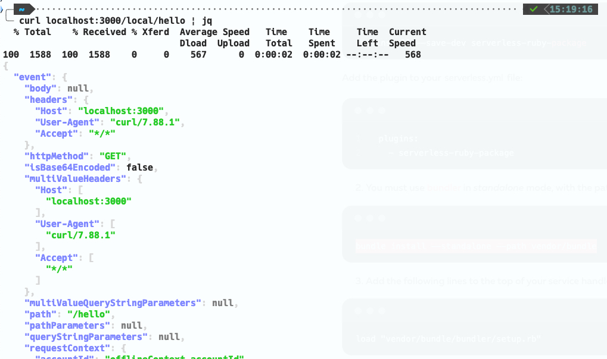

## 事前準備 aws vault
aws vaultの設定をまず行い、以下のコマンドで、認証情報をローカルセッションにセット
```
# AWS関連の環境変数をリセット
unset AWS_VAULT

# aws vaultで認証
aws-vault exec <your_profile>
```


## コンテナのbuild
```
# build
docker compose build

# コンテナの起動
docker compose up -d

# slsコンテナにbashでログイン
docker compose exec sls bash --login
```

## slsコンテナ内で実行するコマンド
```
# アプリケーションを置いてあるディレクトリは/opt/app
cd /opt/app
```

### 初期設定
```
sh init.sh
```

### ローカルでサービスを起動する
```
sls offline start
```

### dynamodbのテーブル作成
```
aws --endpoint-url http://localstack:4566 --region ap-northeast-1 \
  dynamodb create-table --table-name sample_user --attribute-definitions \
    AttributeName=user_id,AttributeType=S \
    AttributeName=user_name,AttributeType=S \
    --key-schema AttributeName=user_id,KeyType=HASH \
     AttributeName=user_name,KeyType=RANGE \
    --provisioned-throughput ReadCapacityUnits=1,WriteCapacityUnits=1
```


### dynamodbの管理画面
http://localhost:8001 にアクセスして、dbynamodbをGUIで操作可能

## ローカルで動作確認
```
# 動作確認
curl localhost:3000/local/hello | jq
```


```
# dynamodbにデータ作成
curl --location 'http://localhost:3000/local/users' \
--header 'Content-Type: application/json' \
--data '{
    "user_id":"1",
    "user_name":"name"
}'
```

```
# dynamodbからデータ取得
curl --location 'http://localhost:3000/local/users'
```

## デプロイ
```
# slsコンテナ内で以下を実行
sls deploy --stage <stageを指定する>
ex) sls deploy --stage dev
```
デプロイが完了すると以下のようにawsリソースが作成されます。


## リソース削除
```
# slsコンテナ内で以下を実行
sls remove --stage dev
```
